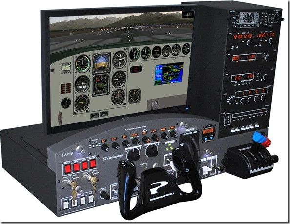
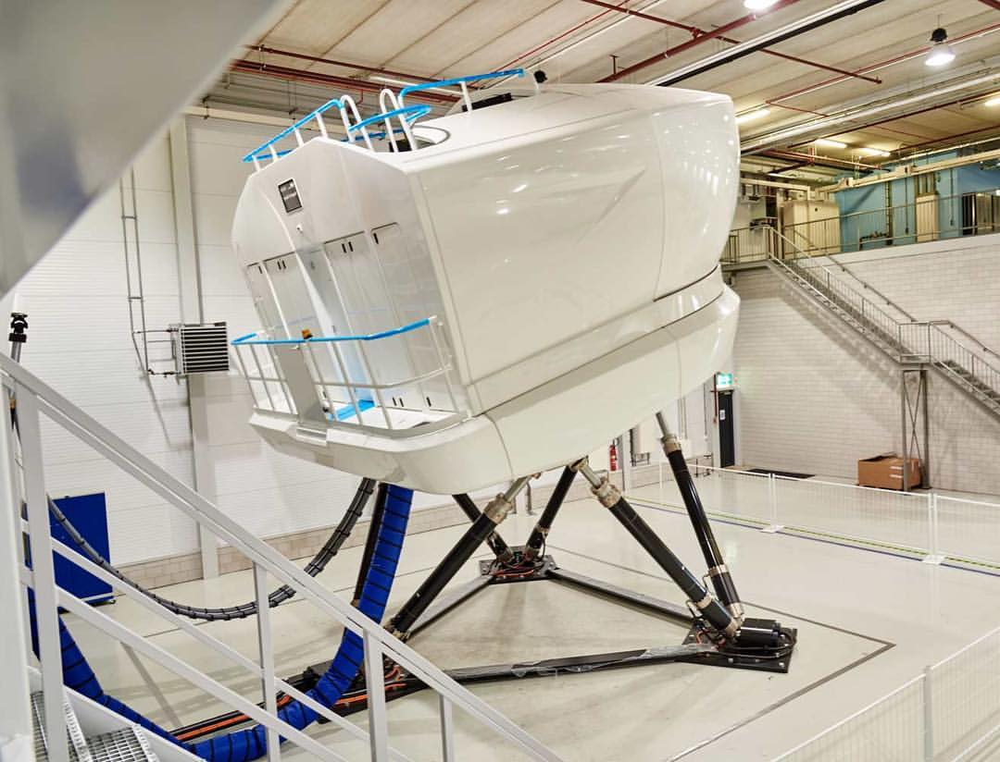
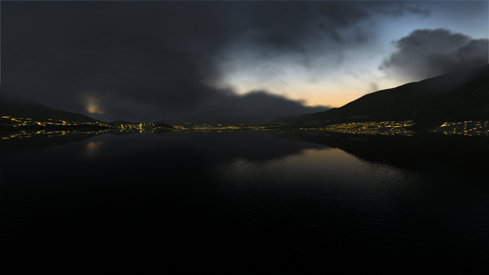

Creating a flight simulator engine or image generator (IG) already has its lot of technical challenges. You have to render land on huge distances, you have to rely on some automated processes to handle the amount of data, your world is mostly filled with natural elements not always being easy to render realistically (like a layer of clouds you have to be able to fly through), etc... 
A lot of graphics research is dedicated to theses issues and as open world games are getting larger and larger, facing similar constraints, most of the techniques you need for this are getting well documented. DICE's Frostbite engine has brought some interesting terrain rendering methods; some brilliant INRIA research workers have developed techniques for outdoor lighting, ocean and forest rendering; Asobo Studios is achieving a feat in weather rendering with the new Microsoft Flight Simulator...
This article will not focus on flight simulator engines particularities but on --professional and certified-- ones being used on FSTDs (Flight Simulation Training Device).
I will try here to give some glimpse into these particularities.

---

## What is a certified flight simulator ?

At first, you might think adding the words professional and certified is just a way to show off. :trollface: 
It's not, the common mistake is to consider these as an improved or more exigent version of wide audience flight simulators. Despite obviously having a lot of similarities, they have a very different goal and it has a strong impact on the design choices. In fact, we'll see that certifying a wide audience FS is not flawless and that most passionate simmers would not trade their "cheap" homepit for a 300,000$ FSTD (unless to sell it and build an even greater homepit !!)

#### Definition

A certified FSTD is a device that has been evaluated and certified by aeronautical authorities like EASA or FAA. It has to fulfill their respective regulation requirements and considered enough representative of a real aircraft to be used as a training device. In fact, it's not only the device that is evaluated but also the way it's being used. Therefore, unlike a car which would be evaluated and certified a single time in its factory condition, each FSTD is evaluated where it will be used and in its training context. The certification process is also repeated every year to make sure the device and training program is still fulfilling requirements.
Having an FSTD is not mandatory to run a pilot training program but the key here is that a portion of the mandatory flight hours can be credited on the simulator, making it far more cost effective than a real plane.
There are different levels of certification depending on whether it is ground based or on a motion platform, whether it's representing a generic class of aircraft or a specific aircraft model, whether it's supposed to provide a basic instrument flight training or an advanced flight and navigation procedures training for multicrew aircraft and a lot of other factors like this. In concrete terms, if we take EASA certification levels, it will range from a BITD (Basic Instrument Training Device) where a desktop device is enough to a FFS (Full Flight Simulator), accurately simulating a A320 or B737 on a motion platform and costing 10 to 12 million dollars.
Each certification class comes with its set of requirements and for the regulation lovers that you are, here is the [EASA CS-FSTD(A)](https://www.easa.europa.eu/sites/default/files/dfu/CS-FSTD%28A%29%20%E2%80%94%20Issue%202.pdf) regulation 

 &nbsp;&nbsp; 

#### Regulations over realism

While most people would expect a professional flight simulator to be far more realistic than any wide audience one, you would be surprised to see it's not always the case. Once again, the focus is not the same, you have to see an FSTD as a procedure trainer and there are many things that don't need to be realistic in a procedure trainer. 
For instance, believe it or not, most of the certification levels will not require you to simulate a full stall as stall recovery is not part of the associated training program. Don't even talk about spins... But if that magneto switch "click" effect is not pronounced enough or your mixture lever tip shape is wrong, you are good for a remark as being able to operate your cockpit controls just by the feeling of it is really important for a pilot training.
On the contrary, wide audience simulators forums are full of angry simmers post yelling at the developers how inaccurate that Fw190 bar is, spending hours searching for pictures and testimonies in pilot biographies that will prove their point. But is LFPG runway 09L being 3 feet lower than it should be really an issue ?
Your primary goal as a FSTD manufacturer is to complete all the regulation requirements. Of course this is the general idea. In reality your customers will expect a bit more from you, the authorities will always try to enlarge the scope of their requirements and your product will be more competitive if it has features your competitors don't have.
Developing the Image Generator follows the same rules. All the eye candy is most of the time superfluous and that explains why some IGs look a bit like the first Tomb Raider... The devil will instead hide in "details" like the visibility angles of a PAPI lighting system or a runway being visible from too far away during a CAT I approach in bad weather conditions.
In some cases, being realistic can even become an issue. Forget about having a nice halo of dazzling light when the sun light is forward scattered by a thin layer of fog : FSTD control station is supposed to define a visibility distance and having your IG effective visibility being variable and not matching that setting will be an issue. :cry:

#### Being vague is being smart !

Have you finished reading the CS-FSTD(A) document ? If not, you've probably not noticed that this regulation is not always defined by accurate and easy to follow criterions. Instead it is a combination of objective and subjective tests, some of it being very vague. This is the cause of endless negotiations between FSTD manufacturers, customers and authorities but has the bright side of making the regulation flexible and compatible with the evolution of technologies in flight simulation.
This aspect has a strong impact on the design choice for a 3D engine.

Let's take article 3.d.1 as an example :

>System geometry. The system fitted shall be free from optical discontinuities and artefacts that create non-realistic cues.

You'll agree with me that this covers a lot of potential problems and would be an issue for most modern 3D engines. This is a really important article as vision is playing an important role in the sensation of movement and the continuity of the image display is decisive for immersion and avoiding motion sickness. Also keep in mind that IG images are most of the time projected on very wide screen making any blinking pixel very obvious.
As a consequence, you'll probably prefer a forward renderer with MSAA to a deferred one with TAA for example. 
During my engine development, I kept facing this issue, fighting aliasing, moiré patterns and so on. Some really interesting effects like screen space reflections did not make it in the final build as their flaws were too noticeable.

---
## Engine Design

#### Big wide world

The first specific feature of a flight simulator IG is its planet-sized engine design. Your primary resource is not a 3D level designed by a technical artist but terabytes of raw data coming in variable formats from variable sources. Processing all of this to end up with moderate sized and graphics API friendly format ready to  display

#### Accuracy

While most planet rendering engines will assume a planet is a sphere, a flight simulator will require you to be more precise than that. Due to its rotation and gravitational variations, Earth's theoretical radius is irregular making it rather a geoid than a sphere.  
Modern aircraft being equipped with very accurate navigation systems, assuming Earth is a sphere would lead to inconsistencies.
Therefore, we rely on the WGS84 geodetic system and its coordinate system to obtain an accurate representation of Earth.

#### Performance

