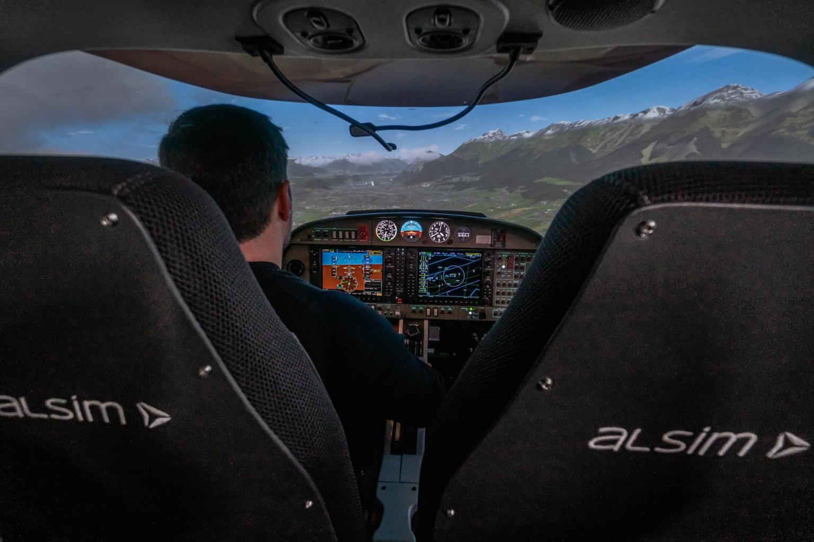

<!---  -->

<iframe width="560" height="315" src="https://www.youtube.com/embed/zePK5w488uI" frameborder="0" allow="accelerometer; autoplay; encrypted-media; gyroscope; picture-in-picture" allowfullscreen></iframe>

Among many other tasks, my main role as a software engineer at Alsim Simulators was to design and implement our flight simulator's image generator (IG). This is quite a specific field in that the final product is designed for professional pilots training rather than entertainment activities. I will try here to give some glimpse into these particularities.

## Big wide world

The first specific feature of a flight simulator IG is its planet-sized engine design. Your primary resource is not a 3D level designed by a technical artist but terabytes of raw data coming in variable formats from variable sources.

## Accuracy

While most planet rendering engines will assume a planet is a sphere, a flight simulator will require you to be more precise than that. Due to its rotation and gravitational variations, Earth's theoretical radius is irregular making it rather a geoid than a sphere.  
Modern aircraft being equipped with very accurate navigation systems, assuming Earth is a sphere would lead to inconsistencies.
Therefore, we rely on the WGS84 geodetic system and its coordinate system to obtain an accurate representation of Earth.

## Performance

## Where's all the eye candy ?

## Regulations over realism

